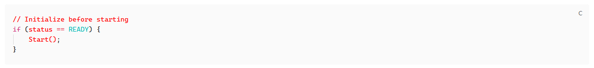

# Code Emphasis

[中文](README.zh-CN.md)

Mark the important parts of code in your Obsidian notes, so they are easier to revisit.



## Highlight text

1. Select text inside a code block.
2. Run **Code Emphasis: Highlight selected text** from the command palette.
3. Optionally assign a shortcut in **Settings → Hotkeys**.

You can also type the markers yourself:

```text
^^// Initialize before starting^^
if (^^status^^ == READY) {
    ^^Start()^^;
}
```

Selecting multiple lines highlights each nonblank line. To remove a highlight, delete its two `^^` markers, or undo immediately after adding it.

## Reading and editing

- **Live Preview:** markers stay hidden until you move the cursor into a highlight or select across it. Only that fragment opens for editing.
- **Reading view:** shows highlights without markers.
- **Source mode:** shows the original markers.
- **Copy code:** the Reading view button removes markers and keeps your comments, indentation and backslashes. Normal editor copy keeps the selected source.

Code and comments use the same style. Backslashes stay unchanged: `\^^fff^^` displays and copies as `\fff`. Highlights cannot span line breaks or nest; unmatched markers stay visible. Paired literal `^^` are treated as markers.

## Settings

- **Language:** Follow Obsidian (default), 中文, or English.
- **Font color:** red by default. Switch off to keep the original text colors.
- **Background color:** off by default. Enable to choose a color.

Both colors can be switched off independently. Restore defaults resets all settings.

## Install

Requires **Obsidian 1.13+**.

**BRAT:** add `elfmedy/code-emphasis` and enable Code Emphasis.

**Manual:** download `main.js`, `manifest.json`, and `styles.css` from the [latest release](https://github.com/elfmedy/code-emphasis/releases/latest). Put them in your vault's `.obsidian/plugins/code-emphasis/` folder, then enable the plugin.

The highlight command currently works in ordinary top-level fenced code blocks. Special blocks such as Mermaid are excluded.

[Upgrading from the old HTML plugin](docs/MIGRATION.md) · [Development](docs/DEVELOPMENT.md) · [MIT license](LICENSE)
